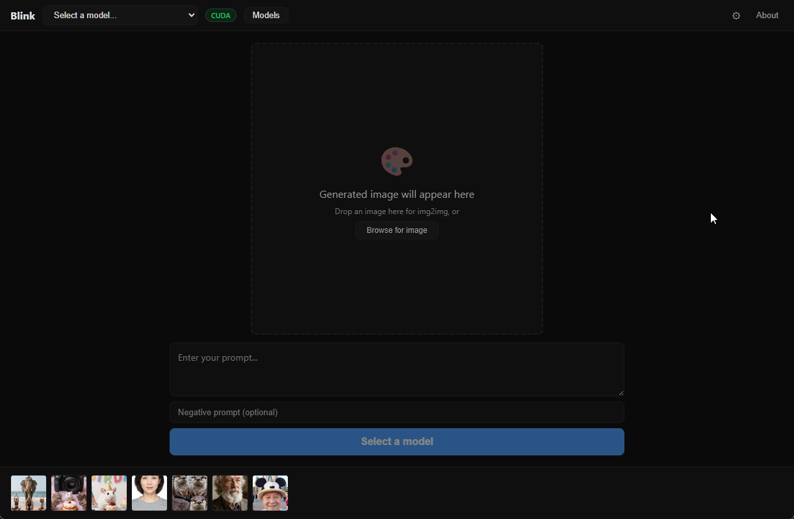

# Blink

Dead-simple local AI image generation. Type a prompt, get an image. No Python. No node graphs. No PhD required.



## Features

- **Dead-simple by default** — just type a prompt and hit Generate
- GPU-accelerated inference (CUDA, Metal, Vulkan, OpenCL, CPU fallback)
- Multiple model architectures (SD 1.5, SDXL, Flux, Z-Image Turbo, Kontext)
- Built-in model browser with one-click downloads from HuggingFace
- Custom model import from any HuggingFace URL
- **Image editing (Kontext)** — load an image, describe changes, get edited result
- **Inpainting** — paint a mask over areas to regenerate with brush/eraser tools
- **Image-to-image** — transform images with prompt guidance
- **LoRA support** — load and stack LoRA adapters per-generation
- **ESRGAN upscaling** — one-button 2x/4x image upscaling
- **Live previews** — see intermediate results during generation (TAESD)
- **Video generation** — text-to-video and image-to-video with Wan models
- **ControlNet** — preserve structure during generation (SD 1.5, canny edge detection)
- Generation gallery with auto-save
- Slide-out settings panel — advanced controls without cluttering the canvas
- Smart model defaults — auto-applies optimal settings on model switch
- Performance tuning (flash attention, memory-mapped loading, VRAM management)
- Dark, minimal UI

## Supported Models

### Generation Models

| Model | Architecture | Size | VRAM | Default Steps | License |
|-------|-------------|------|------|---------------|---------|
| Stable Diffusion 1.5 | SD 1.5 | 1.6 GB | 1.6 GB | 20 | CreativeML Open RAIL-M |
| Stable Diffusion 1.5 (Q8) | SD 1.5 | 2.1 GB | 2 GB | 20 | CreativeML Open RAIL-M |
| Stable Diffusion XL | SDXL | 3.6 GB | 5 GB | 25 | CreativeML Open RAIL++-M |
| Flux.1 Schnell | Flux | 9.9 GB | 10 GB | 4 | Apache 2.0 |
| Flux.1 Schnell (Q8) | Flux | 16 GB | 16 GB | 4 | Apache 2.0 |
| Flux.1 Dev | Flux | 10.1 GB | 12 GB | 25 | FLUX.1 Dev Non-Commercial |
| Z-Image Turbo | Z-Image (Lumina2) | 5.5 GB | 4 GB | 4 | Apache 2.0 |
| Z-Image Turbo (Q8) | Z-Image (Lumina2) | 9.2 GB | 8 GB | 4 | Apache 2.0 |

### Image Editing Models

| Model | Architecture | Size | VRAM | Default Steps | License |
|-------|-------------|------|------|---------------|---------|
| FLUX.1 Kontext Dev (Q4) | Flux Kontext | 9.4 GB | 12 GB | 35 | Non-Commercial |
| FLUX.1 Kontext Dev (Q8) | Flux Kontext | 15 GB | 16 GB | 35 | Non-Commercial |

### Utility Models

| Model | Type | Size | Purpose |
|-------|------|------|---------|
| RealESRGAN x4 Plus | Upscaler | 67 MB | 4x image upscaling |
| RealESRGAN x4 Anime | Upscaler | 67 MB | 4x upscaling (anime) |
| ControlNet Canny (SD 1.5) | ControlNet | 700 MB | Structure preservation |
| TAESD (SD/SDXL/Flux) | Preview | ~5 MB | Live generation previews |

> Multi-file models (Flux, Kontext, Z-Image) include diffusion model + text encoder + VAE. Blink downloads and manages all components automatically.

## System Requirements

- Windows 10+ / macOS 12+ / Linux (Ubuntu 22.04+)
- 8 GB RAM minimum
- GPU recommended:
  - NVIDIA: GTX 1060+ with CUDA Toolkit 12+
  - Apple: M1+ (Metal)
  - AMD: Vulkan SDK
- CPU-only mode available (significantly slower)

## Installation

### Download Release

Download the latest release from [Releases](../../releases).

### Build from Source

#### Prerequisites

- [Rust](https://rustup.rs/) (latest stable)
- [Node.js](https://nodejs.org/) 18+
- [CMake](https://cmake.org/) 3.20+
- [Ninja](https://ninja-build.org/) build system
- Windows: [Visual Studio Build Tools](https://visualstudio.microsoft.com/visual-cpp-build-tools/) with MSVC C++ workload
- Optional: [CUDA Toolkit](https://developer.nvidia.com/cuda-toolkit) 12+ (NVIDIA GPU acceleration)

#### Clone and Build

```bash
git clone --recursive https://github.com/beargleindustries/blink.git
cd blink
npm install
npx tauri build
```

The built binary will be in `src-tauri/target/release/`.

#### Development

```bash
npm install
npx tauri dev
```

#### Build with GPU acceleration

```bash
# CUDA (NVIDIA)
npx tauri build --features cuda

# Metal (Apple Silicon)
npx tauri build --features metal

# Vulkan (AMD / cross-platform)
npx tauri build --features vulkan
```

## Configuration

### Settings Panel

Click the gear icon (⚙) in the header to access all advanced settings:

- **Generation** — Steps, CFG scale, seed, image size, sampler
- **img2img** — Denoising strength for image-to-image and inpainting
- **LoRA** — Add/remove LoRA adapters with per-LoRA strength control
- **ControlNet** — Structure preservation with canny edge detection (SD 1.5)
- **Performance** — Flash attention, memory mapping, VRAM offloading
- **Account** — HuggingFace token for gated model access

Settings auto-apply model-specific defaults whenever you switch models.

### HuggingFace Token

Some models require a HuggingFace account. Set your token in **Settings > Account** to enable downloads for gated models.

## Tech Stack

- [Tauri v2](https://tauri.app/) — Native desktop framework (Rust + web frontend)
- [stable-diffusion.cpp](https://github.com/leejet/stable-diffusion.cpp) — Inference engine (no Python)
- [SolidJS](https://www.solidjs.com/) — Frontend UI
- [ggml](https://github.com/ggerganov/ggml) — Tensor library underlying sd.cpp

## License

MIT — see [LICENSE](LICENSE)

## Credits

Built by [Beargle Industries](https://beargleindustries.com).

### Third-Party

- [stable-diffusion.cpp](https://github.com/leejet/stable-diffusion.cpp) by leejet (MIT)
- [ggml](https://github.com/ggerganov/ggml) by Georgi Gerganov (MIT)
- Model weights sourced from HuggingFace — see individual model licenses in the Model Browser
